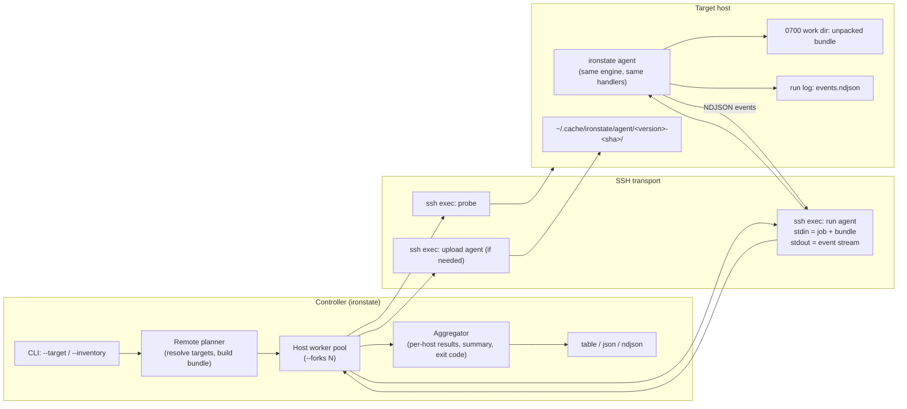
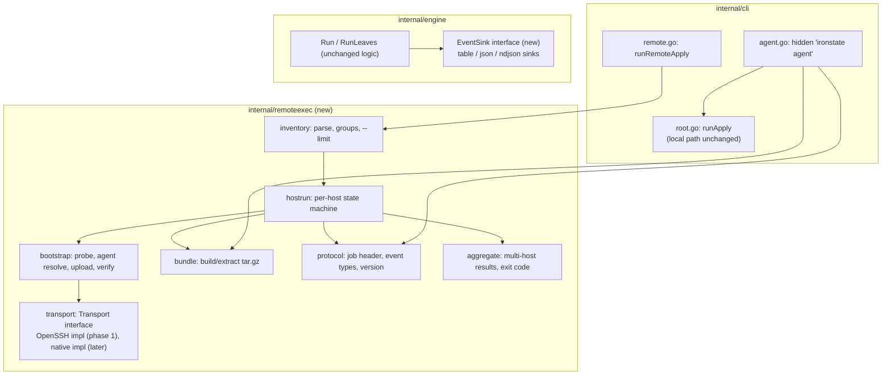
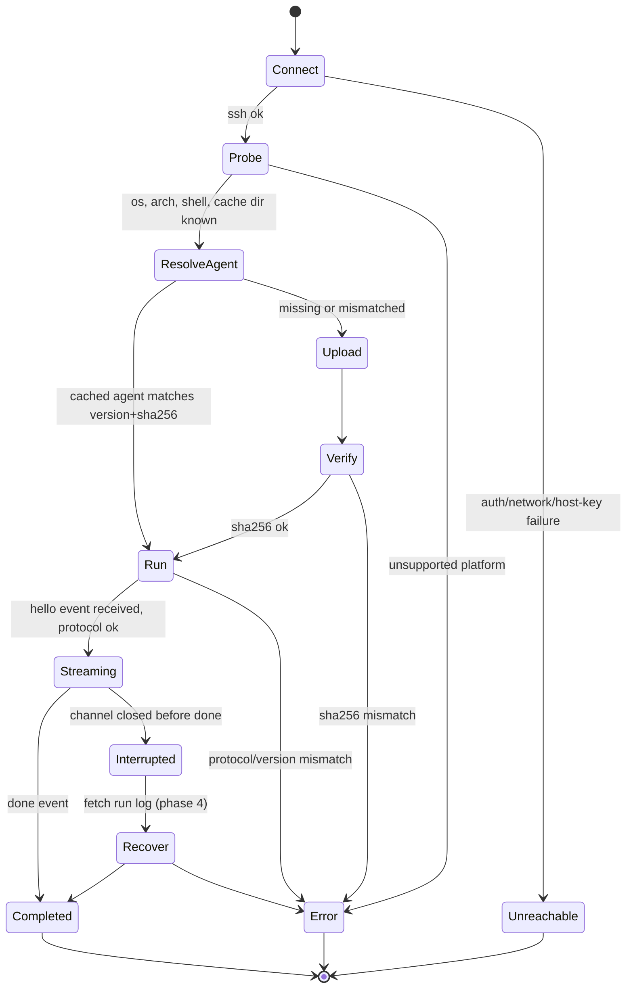
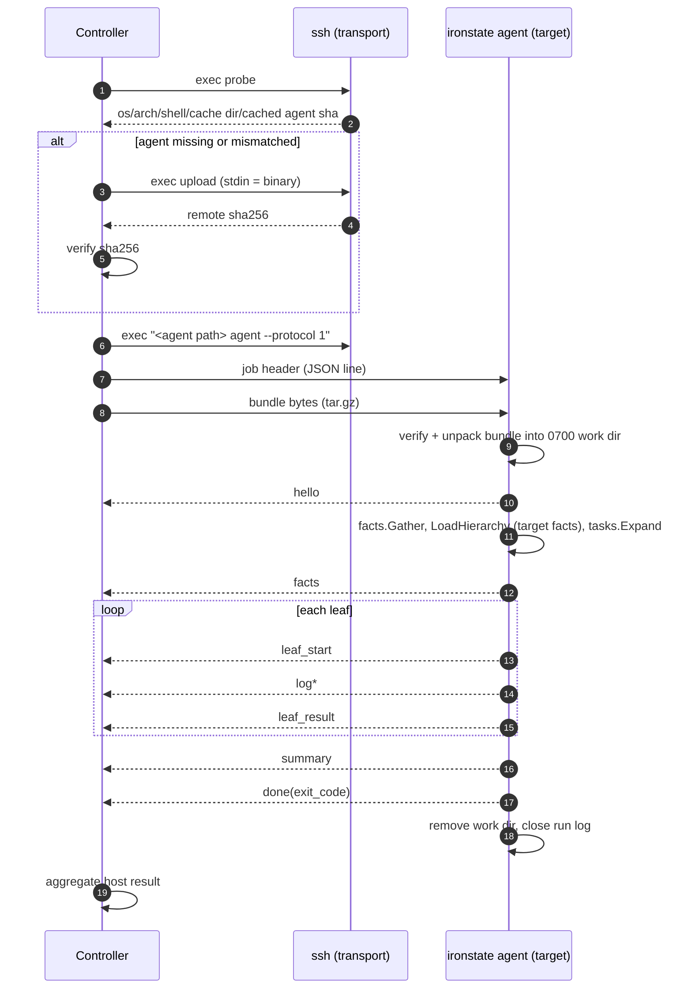

# Remote apply over SSH

Status: IN PROGRESS (phases 0-5 implemented; phase 6 optional and not started; Windows host validation of admin-token semantics and detached-process survival remains), revised after design review (see §15)
Owner: unassigned
Target: unscheduled, phased rollout (see §12)

## 0. Summary

Let one `ironstate` invocation (the **controller**) apply a playbook to one or more remote
machines (**targets**) over SSH, on Linux, macOS and Windows, and report per-host results
back to the controller in the same shapes (`table`, `json`) used today.

The core decision: **ironstate does not proxy individual commands over SSH.** It ships
itself (the `ironstate` binary for the target's OS/arch) plus a **bundle** of the playbook
to the target, runs a hidden `ironstate agent` subcommand there, and streams a versioned
NDJSON event protocol back over the SSH channel's stdout. A remote apply is a local
apply that happens to run on another machine and report back over a pipe.



## 1. Goals

1. Apply an existing playbook to N remote hosts with no change to the playbook itself.
2. Identical semantics to a local run on that host: facts, `hosts/`/`variables/` overlay
   chain, `when`, `become`, handlers, filters, exit codes all behave as if `ironstate`
   were run locally on the target.
3. Works with SSH as the only remote prerequisite (OpenSSH server on Linux/macOS/Windows).
   No Go toolchain, Python, git, or internet access required on the target.
4. Reliable execution: version-pinned, integrity-checked agent; a partial/aborted run is
   detectable and its results recoverable.
5. Structured, streaming, per-host result reporting back to the controller, aggregated
   into a multi-host summary and a well-defined exit code.
6. Secure by default: strict host-key checking, no secrets on argv or on target disk,
   no shell-injection surface from inventory/playbook values.

## 2. Non-goals (and why)

- **Agentless command proxying (Ansible-style "run each module over SSH").** Rejected; see
  §3. ironstate's handlers do in-process filesystem/registry/API work (`os.WriteFile`,
  `x/sys/windows/registry`, Task Scheduler XML, facts via OS APIs), not just
  `exec.Runner` calls. Proxying would need a remote filesystem/registry abstraction under
  ~40 handlers and would multiply round trips per leaf.
- **A long-running daemon / pull-mode server on targets.** Out of scope. The agent is
  ephemeral: it lives for the duration of one run. (Pull mode is already possible today:
  cron + `ironstate --apply` on the target.)
- **Orchestration across hosts** (rolling updates, "run task X on host A then task Y on
  host B", cross-host fact references). Each host runs the whole playbook independently.
  Cross-host dependencies are a separate proposal if ever needed.
- **Password-based SSH auth handled by ironstate.** Auth is delegated to the SSH client
  (keys, agent, certificates, FIDO2, GSSAPI). See §5.
- **Windows targets without OpenSSH Server.** WinRM is not supported.

## 3. Execution model decision

| Option | How it works | Verdict |
| --- | --- | --- |
| A. Command proxy | Engine runs on controller; every `exec.Runner` call / file op is sent over SSH | Rejected: handlers do in-process I/O, Windows registry/Task Scheduler can't be proxied, N round trips per leaf, facts would describe the controller unless all re-implemented |
| B. **Push agent** | Ship `ironstate` + playbook bundle; run it on the target; stream results back | **Chosen**: zero handler changes, exact local semantics, one long-lived channel per host |
| C. Pull | Target fetches the playbook (git) and runs on a schedule | Already possible; doesn't satisfy "controller applies and gets results back" |

Consequences of B that the rest of the design addresses:

- **The controller never loads, overlays, or expands the playbook.** It only ships raw
  files. `facts.Gather()`, `LoadHierarchy` (the `hosts/`/`variables/` chain keyed on the
  target's `computer_name`), `ResolveRelativePathsInPlace` (relative `src:`/`script:`
  resolved against the unpacked playbook dir), `filters.dir`, template passes and
  `tasks.Expand` all run on the agent, exactly as in a local run there. Controller facts
  are never sent to the agent.
- Absolute or `~` paths in a playbook (e.g. `copy: {src: /etc/hosts}`) resolve **on the
  target**, consistent with "same as running locally there". The bundler emits a
  best-effort warning for such paths and for relative paths that escape the bundle root
  (§7).
- The controller needs an `ironstate` binary for each target OS/arch (§6).
- Everything the run reads from the controller's disk must be shipped (§7).
- Anything interactive (trust prompts, become password) must be resolved on the controller
  before the agent starts, because the agent has no TTY (§8).
- **All template evaluation happens on the target.** `facts.*`, `lookup('env', ...)`,
  `lookup('file', ...)`, script filters, `lookup('url', ...)` all execute remotely. This is
  the intended semantic ("same as running locally there"), and is called out in docs.

## 4. Components



New package `internal/remoteexec` (name avoids collision with the existing
`internal/remote`, which resolves `uses:` sources).

### 4.1 Transport interface

```go
type Transport interface {
    // Exec runs one remote command line; stdin/stdout/stderr are streamed.
    Exec(ctx context.Context, cmd RemoteCommand, stdin io.Reader, stdout, stderr io.Writer) (exitCode int, err error)
    Close() error
}
```

`RemoteCommand` is a structured value (program + args + target shell kind), never a raw
string concatenated from user input. Quoting is done by a per-shell quoter (`posix`,
`pwsh`) with an allow-list fallback that refuses anything it can't quote safely.

## 5. SSH transport

### 5.1 Phase 1: OpenSSH client (`ssh` on PATH)

Chosen as the default because it is present on Windows 10+/11, macOS and every Linux
distro, and it already honors everything users have configured: `~/.ssh/config`
(`Host` aliases, `Include`, `Match`, `ProxyJump`, `IdentityFile`, certificates),
ssh-agent (incl. the Windows OpenSSH agent named pipe, 1Password/Bitwarden agents), FIDO2
`sk-` keys, and `known_hosts`. Re-implementing that fidelity on `golang.org/x/crypto/ssh`
is a large, ongoing surface (see §5.2).

Invocation shape (argv, no shell on the controller side):

```
ssh -T -o BatchMode=yes -o ConnectTimeout=<n> -o ServerAliveInterval=15 \
    -o ServerAliveCountMax=4 [-p port] [-l user] [-i key] [extra -o from inventory allow-list] \
    -- <host> <remote command>
```

- `--` before the host blocks option injection via a malicious host string
  (e.g. `-oProxyCommand=...`). Hosts/users are also validated against a strict pattern.
- `BatchMode=yes` always: no password/passphrase/host-key prompts, so runs never hang.
  Users load keys into their agent first. (An interactive mode is deferred until
  someone actually needs it.)
- Host-key policy is whatever the user's ssh config says; ironstate never adds
  `StrictHostKeyChecking=no`. An opt-in `--ssh-accept-new-host-keys` maps to
  `StrictHostKeyChecking=accept-new`.
- Connection reuse: on POSIX controllers, `ControlMaster=auto`,
  `ControlPath=<tmp>/ironstate-<uid>/%C` (0700 dir; kept short because Unix socket paths
  are limited to ~104-108 bytes, and `%C` is already a hash), `ControlPersist=60` so the
  2-3 execs per host share one TCP/auth handshake. Windows' OpenSSH client does not
  support multiplexing; there each exec is a fresh connection (acceptable: ≤3 per host).
- Remote shell noise: sshd runs non-interactive commands through the user's login shell,
  and bash sources `~/.bashrc` for SSH commands, so rc files can print to stdout. The probe
  wraps its output in sentinel lines (`__IRONSTATE_BEGIN__`/`__IRONSTATE_END__`) and
  parses only between them; the agent stream only accepts lines starting with `{"v":1,`
  (§9.1).

### 5.2 Later phase: native transport (`golang.org/x/crypto/ssh`)

Optional `--ssh-transport native` for controllers without an `ssh` binary, or where
fine control matters (one connection, multiple channels; programmatic keepalive). Needs:
`x/crypto/ssh/knownhosts`, `x/crypto/ssh/agent` (Unix socket / Windows named pipe), a
`~/.ssh/config` parser (`kevinburke/ssh_config`) with a documented subset (no `Match exec`,
`ProxyCommand` limited). Not a phase-1 requirement.

## 6. Agent bootstrap

### 6.1 Per-host state machine



### 6.2 Probe

One exec, detects the target's default shell and platform:

1. POSIX attempt: `uname -s -m; printf '%s\n' "$HOME"; command -v sha256sum shasum openssl busybox`.
2. If the output doesn't parse (Windows `cmd.exe`/`powershell` default shell), Windows
   attempt: `powershell -NoProfile -NonInteractive -EncodedCommand <b64>` printing
   `$env:PROCESSOR_ARCHITECTURE`, `$env:LOCALAPPDATA`, OS version as one JSON line.
   (`-EncodedCommand` avoids cmd.exe vs pwsh quoting differences entirely.)

An inventory `platform:` hint skips the failed first attempt. The probe also reports:

- whether the cached agent exists and its sha256;
- whether the agent dir is executable (POSIX: write+run a 1-line script; catches `noexec`
  home mounts), falling back to an inventory/config `agent_dir` override, else a clear
  error;
- `sudo -n true` result (POSIX), so a playbook with `become` fails fast with "sudo needs a
  password (use --ask-become-pass) or has requiretty" rather than mid-run. Hosts marked
  `become: false` in inventory bypass the become requirement and run as the SSH user.
- SHA-256 support via `sha256sum`, `shasum`, `openssl dgst -sha256`, or BusyBox's
  `sha256sum` applet, covering common embedded Linux systems.

Unsupported targets (anything other than linux/darwin/windows on amd64/arm64, matching
`.goreleaser.yaml`) fail at probe. Linux/darwin/windows builds are `CGO_ENABLED=0`, so
the same Linux binary runs on glibc and musl (Alpine) targets.

### 6.3 Agent binary resolution (controller side)

The agent version **must equal** the controller version (schema/handler behavior is
version-specific). Resolution order for `<os>/<arch>`:

1. `--agent-binary <os>/<arch>=<path>` (explicit; required for dev builds cross-arch).
2. Controller's own `os.Executable()` if target os/arch == controller os/arch.
3. Local cache `UserCacheDir/ironstate/agents/<version>/<os>_<arch>/`.
4. (Phase 2) Download the matching release archive from GitHub releases, verify against
   that release's `checksums.txt` (and cosign bundle if `cosign` is available, mirroring
   `install.sh`), extract, store in (3). Uses `GITHUB_TOKEN` if set to avoid anonymous
   API rate limits. Never attempted for a `dev` version.
5. Fail with a precise message (dev build + cross-arch → tells user to pass
   `--agent-binary` or `GOOS=... go build`).

Remote agent cache dirs are keyed by `<version>-<sha256[:12]>`, not version alone, so
two different `dev` builds never collide and a cached agent is only reused when it is
byte-identical to the one the controller would ship.

### 6.4 Upload and verify

- Target path: POSIX `$XDG_CACHE_HOME|~/.cache/ironstate/agent/<version>-<sha>/ironstate`;
  Windows `%LOCALAPPDATA%\ironstate\agent\<version>-<sha>\ironstate.exe`. Parent dir
  created `0700` (Windows: inherits user profile ACL).
- macOS: binaries written through an SSH stream get no `com.apple.quarantine` xattr, and
  Go's linker ad-hoc signs darwin/arm64 binaries, so Gatekeeper does not block them.
- Transfer: stream the binary over the exec channel's stdin into a temp file in that dir
  (`cat > tmp` on POSIX; a fixed `-EncodedCommand` script copying
  `[Console]::OpenStandardInput()` to a file on Windows), then remote-side sha256 and an
  atomic rename. No `scp`/`sftp` dependency by default. If the Windows raw-stdin path
  proves unreliable in the phase-3 spike, fall back to the `sftp` subsystem (enabled by
  default in Windows OpenSSH Server); the sha256 check catches corruption either way.
- The controller compares the reported sha256 to the expected one before ever executing
  the binary. A mismatch is a hard error for that host.
- Cached agents are reused across runs; `ironstate remote clean` removes them.

## 7. The bundle

Everything the run would read from the controller's disk, packaged as `tar.gz` and sent on
the agent's stdin after the job header. Unpacked by the agent (in Go, so no remote
`tar` dependency) into a fresh `0700` work dir, deleted after the run unless `--keep-remote`.

| Bundle path | Source on controller | Notes |
| --- | --- | --- |
| `playbook/` | bundle root: playbook dir by default, `remote.bundle_root` to widen (e.g. repo root when a playbook uses `../shared/...`) | honors `.ironstateignore` (glob per line: base-name match, or path match if the pattern has a `/`; trailing `/` = dirs only); `.git/`, `.env`, `.secrets` always excluded at any depth; symlinks stored as links and rejected on extract if they escape the work dir |
| `filters/` | the controller's resolved `filters.dir`, only when it lies **outside** the playbook dir (a relative `filters.dir` resolves against the playbook dir, so it's usually already inside `playbook/`) | agent's `filters.dir` is set to `../filters` |
| `ironstate.yaml` | controller's effective `filters.*` config | agent runs with cwd = bundle root, so this is picked up like a local `ironstate.yaml` |
| `vars-files/NN-<name>` | each `--vars-file`, in order | order preserved via `NN` prefix |
| `uses/<hash>/` | pre-fetched `uses:` sources (phase 5) | see §8.2 |

No per-file manifest: the job header's whole-bundle sha256 already covers integrity, and
the entry playbook path travels in the header's options.

Not in the bundle (sent in the in-memory job header instead, never written to target disk):
`.env`/`.secrets` key/values, `--var` overrides, become password, forwarded env vars.

`.env`/`.secrets` files themselves are never put in the bundle even if they sit inside the
bundle root (their parsed values travel in the header).

Bundle size: warn above `remote.bundle_warn_mb` (default 50), fail above
`remote.bundle_max_mb` (default 500). A content-addressed bundle cache on the target is a
possible later optimization, not v1.

Best-effort bundler lint (warnings, never errors): literal (non-templated) `src:`/
`script:` values that are absolute, start with `~`, or escape the bundle root after
`..` resolution. Templated values can't be checked statically; they fail on the agent
with the normal "file not found" error.

## 8. Controller-side resolution of interactive/credentialed inputs

The agent's stdin is the protocol channel and it has no TTY, so:

### 8.1 `become`

- Default: unchanged semantics on the target (`sudo -u` on POSIX). Requires passwordless
  sudo (`NOPASSWD`) or connecting as root, **or**
- `--ask-become-pass`: controller prompts once (no echo), sends the password in the job
  header. Implementation stays inside `internal/exec`, following its existing "ambient
  become" pattern (`SetBecome`/`WrapForBecome`): today `Runner.Run(exe, args)` has no
  stdin, so a package-level `SetBecomePassword` makes `WrapForBecome` emit
  `sudo -S -k -p '' ...` and makes `realRunner` set `cmd.Stdin` to `password\n` only for
  that wrapped invocation. `-k` forces sudo to always read the password, so stdin
  consumption is deterministic. No handler signatures change. Never on argv, never in
  env, never logged (registered as a secret on receipt).
- The probe's `sudo -n true` check (§6.2) turns "needs password"/`requiretty` into an
  up-front error when the run would need `become` without `--ask-become-pass`.
- Windows targets: OpenSSH Server gives administrators a full (elevated) token, and
  `sudo.exe` does not work in a non-interactive session. Documented rule: connect as an
  admin account to run elevated tasks; `become: true` on a Windows target from an admin
  session is a no-op, from a non-admin session is a clear per-leaf error.

### 8.2 `uses:` remote sources

Trust prompts and git credentials live on the controller. The controller statically
walks the task tree for `uses:` directives (`remote.Describe`, no fetch), prompts/approves
as it does locally, `remote.Resolve`s them into its own cache, and ships them in
`uses/<hash>/`. The agent runs with `uses` resolution in **offline mode**: it maps each
source to the bundled copy and errors (never fetches) if a source wasn't pre-bundled
(e.g. a templated source depending on target facts). Implemented in phase 5; see its
as-built notes in §12 for the exact rules.

### 8.3 Environment

Controller shell env is **not** forwarded by default (the target is a different machine).
`.env`/`.secrets` (cwd-relative on controller, as today) are parsed on the controller and
their key/values forwarded in the job header; the agent sets them in its process env and
registers `.secrets` values for redaction before loading anything. Additional names via
`--forward-env NAME` (repeatable) or `remote.forward_env: [...]` in `ironstate.yaml`.

`lookup('env', ...)`/`lookup('url', ...)`/`lookup('file', ...)` evaluate on the target.
A playbook that relied on a controller shell variable will see it unset remotely; the
docs call this out and `remote ping` lists `lookup('env', 'X')` literals whose `X` isn't
forwarded (best-effort text scan).

### 8.4 Plugins

Phase 1 rejected playbooks that declare plugins. Phase 5 (as built): for a target on
the controller's own OS/arch, the controller copies each declared plugin it has
installed (binary + manifest, SHA-256 verified like the agent) into the target's plugin
store, so lockfile checksums match. Other targets resolve plugins from their own store;
`--allow-plugin-install` is forwarded, which needs Go on the target. Lockfile checksums
are per-platform, so a lockfile only verifies on targets of the platform that wrote it.

## 9. Protocol

### 9.1 Framing

- **Controller → agent (stdin):** one JSON line (job header), then exactly
  `bundle_size` raw bytes of `tar.gz`, then optional control lines (JSON) until EOF.
- **Agent → controller (stdout):** NDJSON, one event per line, every line starts with
  `{"v":1,` and ends with `\n` (the controller also trims a trailing `\r`). Stream
  protection is done at the **file-descriptor level**, as the very first thing the
  `agent` command does: duplicate fd 1 into a private protocol handle, then point fd 1 at
  stderr (`unix.Dup`/`unix.Dup2` on POSIX; `DuplicateHandle` + `SetStdHandle` on
  Windows), and set `os.Stdout = os.Stderr`. Reassigning `os.Stdout` alone is not
  enough: anything that captured `os.Stdout` earlier, or a child process explicitly
  given fd 1, would still write into the protocol. (Go's `exec.Cmd` with nil `Stdout`
  already uses the null device, so ordinary handler subprocesses are safe either way.)
  The controller treats any non-protocol line as a diagnostic, never a fatal parse error.
- **Agent stderr:** free-form diagnostics; captured per host and shown with `-v` or on error.
- **Signals/pipes:** the agent calls `signal.Ignore(SIGHUP)` and
  `signal.Notify(SIGPIPE)`. Without the latter, Go kills the process on a write to a
  broken fd 1/2. Protocol writes return `EPIPE` instead, which the agent treats as
  "controller gone" (§10).
- **Reading:** the agent reads the header line and the bundle bytes through the same
  `bufio.Reader` (no mixing of buffered and raw reads). The controller always drains the
  agent's stdout and stderr on separate goroutines while writing the bundle, so neither
  side can deadlock on full pipe buffers.

### 9.2 Job header

```json
{"v":1,"type":"job","run_id":"01J...","controller_version":"0.9.0",
 "options":{"apply":true,"tags":["git"],"verbose":false,"vars_overrides":["editor=code"]},
 "env":{"GITHUB_TOKEN":"..."},"secrets":["..."],"become_password":null,
 "bundle":{"size":123456,"sha256":"..."}}
```

The agent verifies the bundle sha256 before unpacking; rejects `..`/absolute/symlink-escape
entries (reusing the zip-slip guard pattern from `handlers/zip.go`).

### 9.3 Events

| type | when | payload |
| --- | --- | --- |
| `hello` | agent start | agent version, protocol `v`, os, arch, pid, run_id, run log path |
| `facts` | after `facts.Gather()` + phase-1 fact leaves | gathered facts (redacted) |
| `leaf_start` | before each leaf dispatch | index, total, stage, module, name |
| `leaf_result` | after each leaf | the existing `jsonResult` shape |
| `log` | every `engine.Info/Warn/Danger` | level, message (redacted) |
| `summary` | end of run | `Stats`, stopped, elapsed |
| `error` | load/parse/fatal error | phase, message, exit_code |
| `done` | last line, always attempted | exit_code |

Size limits: `stdout`/`stderr` fields in `leaf_result` are truncated at 1 MiB each, with
`"truncated": true` added; the controller rejects any single line over 8 MiB as a
protocol error for that host. Bounds controller memory with many hosts.

Version negotiation: controller sends `v`; agent replies `hello` with its own `v`; if
they differ the controller aborts that host. Since the shipped agent is byte-identical to
what the controller selected (§6.3), this is a safety net, not a compatibility matrix.

### 9.4 Sequence



## 10. Ensuring execution

- **Integrity:** agent binary sha256 verified before exec; bundle sha256 verified before
  unpack; exact version match.
- **Single writer per host:** the agent takes a **non-blocking** exclusive lock
  (`<cache>/ironstate/apply.lock`, `flock(LOCK_EX|LOCK_NB)`/`LockFileEx` with
  `LOCKFILE_FAIL_IMMEDIATELY`) for the whole run; a second concurrent apply on the same
  target fails immediately with "run <run_id> in progress" (lock file holds the run id).
  No waiting, no retry. The OS releases the lock if the agent dies.
- **Run log:** the agent appends every event, one complete line per `write`, to
  `<cache>/ironstate/runs/<run_id>/events.ndjson` (0600, secrets already redacted)
  regardless of whether the controller is still connected. A run is complete only if the
  log ends with a `done` event; a reader ignores a truncated final line. Retention: last
  20 runs.
- **Disconnects:** the agent treats `EPIPE` on the protocol handle as "controller gone":
  it keeps writing to the run log and **stops after the current leaf** (never starts new
  leaves unattended), then emits `summary`/`done` to the log. Rationale: ironstate is
  test-then-act, so a rerun converges from a partial run, while finishing unattended
  changes state nobody is watching. Users who want unattended completion use detached
  mode. Caveat to verify in the phase-3 spike: Windows OpenSSH Server may terminate the
  session's process tree on disconnect; the run log (flushed per event) still records
  everything up to that point.
- **Recovery (phase 4):** on an interrupted stream the controller reconnects (bounded
  retries with backoff) and reads the run log for that `run_id`;
  `ironstate remote logs <host> [run_id]` does the same on demand.
- **Cancellation:** Ctrl-C on the controller sends `{"type":"cancel"}` on stdin; the agent
  stops after the current leaf and emits `summary`/`done`. A second Ctrl-C closes the SSH
  sessions.
- **Timeouts:** `ConnectTimeout`, SSH keepalives (dead peer detection), optional
  `--host-timeout` for the whole host run.
- **Retries:** only the connect/probe/upload stages are retried automatically. The run
  stage is never auto-retried; re-running is the user's choice (ironstate is
  test-then-act, so a rerun converges, but the controller shouldn't decide that silently).
- **Detached mode (phase 4):** `--remote-detach` starts the agent via
  `setsid`/`nohup` (POSIX) or a one-shot scheduled task (Windows) so it survives the SSH
  session ending, reading job+bundle from the work dir instead of stdin; results are
  collected later via `remote logs`.

## 11. CLI, inventory, and reporting

### 11.1 CLI

Remote mode is the same root command plus target flags, so existing flags keep meaning:

```
ironstate --playbook playbooks/camalot --apply --target rconr@snoke --target kresh.lan
ironstate --playbook playbooks/camalot --inventory inventory.yml --limit linux --forks 4
ironstate remote ping   --inventory inventory.yml          # connect + probe + agent hello
ironstate remote logs   snoke [run_id]
ironstate remote clean  --inventory inventory.yml           # remove cached agents/run logs
```

Implemented flags: `--target` (repeatable), `--inventory`, `--limit`, `--forks` (default 5),
`--agent-binary`, `--no-agent-download`, `--remote-agent-dir`, `--skip-agent-verification`,
`--ask-become-pass`, `--forward-env`, `--ssh-config`, `--ssh-accept-new-host-keys`,
`--host-timeout`, `--remote-detach`, plus the existing `--allow-remote-uses` and
`--allow-plugin-install`, which apply to remote runs too. `--ssh-option`, `--keep-remote`
and the `ironstate.yaml` `remote:` section were designed but not built (see "Designed but
not built" in §12).

Dry run carries over unchanged: without `--apply` the job header says `apply: false` and
every target runs in dry-run mode.

`--target local` is a reserved name that runs the agent as a local child process via the
same `localTransport` used in tests (no SSH), so an inventory can include the controller
itself and get identical reporting. `localhost` is an ordinary SSH target.

### 11.2 Inventory

Deliberately minimal; connection and elevation settings only. Configuration differences between hosts
still belong in the playbook's existing `hosts/`/`variables/` overlay chain, which
**already works per target** because the agent gathers the target's own facts.

```yaml
# inventory.yml
defaults:
  user: rconr
  port: 22
hosts:
  snoke:   { address: snoke.lan }
  kresh:   { address: 10.0.0.12, platform: linux }
  router:  { address: router.lan, become: false }
  krayt:   { address: krayt.lan, platform: windows, user: rconr }
groups:
  linux: [snoke, kresh]
  windows: [krayt]
```

- `address` defaults to the inventory key, so an `~/.ssh/config` `Host` alias "just works".
- `become: false` disables playbook become directives for that host. Tasks run as the SSH
  user; this does not elevate privileges. Omitted `become` honors the playbook as written.
- Inventory names are labels only; overlay selection uses the target's real
  `computer_name`. A host whose inventory name differs from its hostname is reported with
  both.
- JSON schema added alongside `ironstate.schema.json`.

### 11.3 Reporting

- **table:** live per-host progress lines (`[snoke] 12/95 ✔ git ...`), then per-host
  result tables (grouped, not interleaved), then a cross-host summary:

  | host | status | total | installed | uninstalled | skipped | failed | time |
  | --- | --- | --- | --- | --- | --- | --- | --- |

  Remote-origin strings are stripped of terminal control sequences before printing.
- **json:** one document at the end:
  ```json
  {"run_id":"...","hosts":[{"name":"snoke","address":"snoke.lan","computer_name":"SNOKE",
    "status":"ok","exit_code":0,"facts":{...},"results":[ /* existing jsonResult */ ],
    "stats":{...},"duration_ms":1234,"error":null}],
   "stats":{"hosts":2,"ok":1,"failed":1,"unreachable":0}}
  ```
  (Local `--output json` keeps its existing bare-array shape.)
- **ndjson (new, also usable locally):** the §9.3 events re-emitted with a `host` field;
  for CI/log shipping.
- **Exit codes:** `0` all hosts ok; `1` any host failed/stopped; `2` controller-side
  load/config error (before any host ran); `3` one or more hosts unreachable or bootstrap
  failed (and none failed in apply). Precedence: 2 > 1 > 3 > 0. Reasoning: `1` means
  "something was attempted and failed; a human should look", which matters more than
  `3`, which means "safe to just retry later". A scheduler can retry on `3` alone without
  masking a real apply failure. Per-host statuses in JSON give the full picture.

## 12. Phases

Each phase is independently shippable and testable.

### Phase 0: Local refactors (no SSH) - DONE

- `engine.EventSink` interface; `Info/Warn/Danger`, progress, facts panel, results and
  summary all flow through it. Existing table/json output become sinks (output identical,
  covered by existing tests + golden files).
- `--output ndjson` for local runs (protocol §9.3 without `host`).
- Hidden `ironstate agent --protocol 1`: reads job header + bundle from stdin, runs the
  normal `runApply` against the unpacked bundle, emits events on stdout.
- `internal/remoteexec/bundle` + `protocol` packages with fuzz tests (bundle extraction
  path safety, NDJSON parsing).
- A `localTransport` (spawns `ironstate agent` as a child process) to test the whole
  controller↔agent path end-to-end in `go test` without SSH.

As built (differences from the bullets above, and why):

- **Sink lives in `internal/cli`, not `internal/engine`.** `cli.runOutput` has two
  implementations: `consoleOutput` (table/json + spinner, byte-identical to before) and
  `ndjsonOutput`. The engine only gained `Options.OnResult`; its existing `Progress` and
  `OnFactsGathered` callbacks were already the right hooks, and the log hooks were
  already swappable package vars. A new engine interface would have duplicated them.
- `engine.JSONResult`/`ToJSONResult` exported (was `jsonResult`) so `--output json` and
  `leaf_result` events share one redacted shape; `engine.Stats` gained JSON tags.
- Packages: `internal/remoteexec` (`Prepare` builds job + bundle, `RunHost` drives one
  agent and collects a `HostResult`, `Transport` + `LocalTransport`),
  `internal/remoteexec/bundle`, `internal/remoteexec/protocol`.
- `packages.ParseEnvFile` added (read `.env`/`.secrets` without `os.Setenv`) for the
  controller side.
- Agent stdout protection is the `os.Stdout = os.Stderr` swap only; the fd-level redirect
  and SIGPIPE/SIGHUP handling stay in phase 1 as planned (they only matter once a real
  SSH channel can drop). The agent declines every `uses:` trust prompt (no TTY).
- The agent verifies the bundle sha256 against a temp copy *before* extracting, and
  extraction runs in a fresh `MkdirTemp` dir removed afterwards (`--keep-work-dir` for
  debugging).
- End-to-end tests re-exec the test binary as the agent (`TestMain` +
  `IRONSTATE_TEST_RUN_AGENT=1`), so no prebuilt binary is needed. Covered: vars-file +
  `--var` + `.env` + `.secrets` forwarding with redaction, `include:` from the bundle,
  stopped run (exit 1), load error (exit 2), tampered bundle, event ordering.
- New fuzz targets (`FuzzExtract`, `FuzzReadJob`, `FuzzParseEvent`) added to `ci.yml`
  and the Taskfile `fuzz-smoke` task.

### Phase 1: Single POSIX target over OpenSSH - DONE

- OpenSSH transport, `--target` (repeatable but sequential), `--target local`,
  Linux/macOS targets only.
- Probe (incl. noexec + `sudo -n` checks), agent resolution (self / `--agent-binary` /
  cache only, **no release download yet**), upload, verify, run, stream, aggregate,
  table+json output, exit codes.
- Correctness basics that can't wait: fd-level stdout protection, SIGPIPE/SIGHUP
  handling, non-blocking run lock, run log, stop-after-current-leaf on disconnect,
  Ctrl-C cancel message.
- `remote ping` (connect + probe + agent `hello`): the cheapest way to debug setup.
- Errors (not silent skips) for: plugins declared, remote `uses:`, Windows target,
  `become` needing a password.
- Integration test: containerized `sshd` (Linux) in CI.
- README section + `doctor` check for `ssh` on PATH.

As built (differences from the plan, and why):

- **Execs per host: probe, check, [upload], run.** The probe can't know the agent's
  path before the controller picks a binary for the reported OS/arch, so the "is the
  cached agent byte-identical?" check is its own tiny exec. With multiplexing (POSIX
  controllers) the extra exec is ~free; on Windows controllers it's one more handshake.
- **Remote scripts** (`internal/remoteexec/bootstrap.go`) are single-line, `!`-free
  `sh -c` bodies with positional args, each word single-quoted by `PosixCommandLine`,
  so bash/zsh/fish/tcsh login shells all pass them through unchanged. A test enforces
  the single-line rule.
- **Control channel stays open.** After the bundle the controller keeps the agent's
  stdin open; `{"type":"cancel"}` or EOF (controller/SSH gone) both make the agent stop
  before its next leaf (`engine.Options.Cancelled`). The controller closes the channel
  when `done` arrives, because `exec.Cmd` waits for stdin copying to finish;
  `WaitDelay` (5s) covers an agent that dies without `done`.
- **Ctrl-C:** `ssh`/the local agent run in their own process group
  (`Setpgid`/`CREATE_NEW_PROCESS_GROUP`), otherwise the terminal's SIGINT would kill
  `ssh` before the graceful cancel could be sent.
- **Agent failure phases.** `error` events carry `phase` (`job`, `lock`, `bundle`,
  `apply`). The controller maps `job`/`lock`/`bundle` failures to host status `error`
  (exit 3, nothing applied, retryable) and `apply` failures to `failed` (exit 1). So
  "another run in progress" is a retryable 3.
- **Run log** is opened append-only (not exclusive): one run can target the same machine
  twice through two aliases; the lock keeps those passes sequential.
- **`become` preflight** is a static scan of every YAML file in the playbook dir:
  any truthy or templated `become` counts. Conservative on purpose; a false positive
  just asks for passwordless sudo.
- **Flags added beyond the plan:** `--ssh-config` (`ssh -F`, used by the integration
  test and handy for per-project configs), `--remote-agent-dir` (the planned noexec
  escape hatch), and `--forward-env` (pulled forward from §8.3; ~10 lines). The
  `ironstate.yaml` `remote:` section is not wired yet; flags only.
- **Integration test** (`scripts/ssh-integration.sh`, used by both `task test:ssh` and
  the `ssh-integration` CI job) runs `lscr.io/linuxserver/openssh-server` with a fresh
  key. It uses `StrictHostKeyChecking accept-new` in its throwaway ssh config instead of
  `ssh-keyscan`: Windows' bundled `ssh-keyscan` couldn't negotiate a key exchange with
  OpenSSH 10. Skips loudly when docker is missing, like `task race` does without cgo.
- **Verified live from a Windows controller** (Windows OpenSSH client, no multiplexing)
  against that container: ping, apply with table/json output, cached-agent reuse,
  `become` with NOPASSWD sudo (uid 0), the `become` preflight without it, and an
  unreachable host (exit 3). A real mid-leaf SSH disconnect was not exercised live; that
  path (control-channel EOF / stream EPIPE → stop after current leaf → `done` in the
  run log) is covered by the protocol unit tests and the local-transport cancel test.

### Phase 2: Inventory, parallelism, agent download - DONE

As built (differences from the plan, and why):

- **Inventory** (`internal/remoteexec/inventory.go`, schema `inventory.schema.json`,
  shipped in release archives): `defaults`, `hosts`, `groups` exactly as in §11.2, plus
  per-host `agent_dir` and `address: local` (runs on the controller without SSH, handy
  for listing the controller itself and for tests). Unknown keys are errors (strict YAML
  decode) and a schema test keeps the loader and the schema in step. Groups are flat
  (no nested groups) and `all` is reserved; nothing in the plan needed more.
- **Selection:** `--limit` takes host/group names and `all`, keeps the given order and
  de-duplicates; with no `--limit` every host runs, sorted by name. `--target` hosts are
  appended after the inventory selection; `--limit` without `--inventory` is an error.
- **`platform: windows`** is accepted in inventory and selects the PowerShell bootstrap;
  Windows target support was implemented in phase 3.
- **Parallelism:** `--forks` (default 5) via `ForEachHost`, a bounded worker pool that
  returns reports in host order. Live table lines are mutex-guarded and prefixed
  `[host]`; per-host result tables still print grouped at the end. After the first
  Ctrl-C, hosts that haven't started are reported as `error: not started`.
- **Agent download:** release builds fetch
  `v<version>/ironstate_<version>_<os>_<arch>.tar.gz` plus `checksums.txt`, verify the
  archive's SHA-256 against it, and cache the binary under the controller's
  `UserCacheDir/ironstate/agents/<version>/<os>_<arch>/`. When the release has a
  `checksums.txt.sigstore.json` bundle and `cosign` is on `PATH`, the checksums file is
  verified first (same identity/issuer as the README's manual instructions); without
  `cosign` that step is skipped, as `install.sh` does. `GITHUB_TOKEN` is sent only to
  `https://github.com/` URLs (Go drops it on the redirect to the asset CDN). `dev` and
  `-SNAPSHOT` builds never download; `--no-agent-download` disables it for release
  builds. Concurrent hosts on the same platform share one download (mutex).
- **`remote ping`** takes the same `--inventory`/`--limit`/`--forks` flags and prints
  each host as it finishes.
- **Verified live** from the Windows controller: inventory ping of snoke plus an
  unreachable host in parallel (exit 3), sample-playbook dry-run on snoke via
  `--limit snoke` with JSON output, and a controller stamped `0.7.0` downloading,
  checksum-verifying and caching the real v0.7.0 Linux agent from GitHub, then running
  it on snoke.

Original scope:

- Inventory file + schema, groups, `--limit`, `--forks`, multi-host table/json/ndjson.
- Release download + controller-side agent cache (§6.3 step 4).

### Phase 3: Windows targets and become

- Starts with a spike to confirm Windows OpenSSH SFTP behavior, admin sessions receiving
  an elevated token, and process-tree behavior on disconnect.
- Windows probe/upload/run via `powershell -EncodedCommand`, path handling, Windows
  agent cache dir.
- `--ask-become-pass` (`sudo -S -k`) on POSIX; documented Windows elevation model.
- Integration test: Windows runner with OpenSSH Server, including a full-size agent upload.

Implementation status:

- Windows probe, agent cache verification, and agent launch use UTF-16LE
  `-EncodedCommand` PowerShell scripts. Agent binaries transfer through OpenSSH SFTP,
  then PowerShell verifies the hash and atomically moves the staged file into the cache;
  cache paths use `.exe` and Windows separators. The integration test accepts a configured
  Windows target through the same `IRONSTATE_SSH_TEST_*` variables as the POSIX test.
- `--ask-become-pass` prompts once without echo. The password is carried only in the job
  header on stdin, registered for redaction on both sides, and supplied to POSIX sudo via
  `-S -k -p ''`. Windows agent `become` is a no-op only when the SSH process token is
  elevated; otherwise each affected leaf fails before its handler test or mutation.
- Inventory `become: false` explicitly disables playbook become directives for that host;
  the agent runs those tasks as the SSH user. The setting does not grant privileges.
- Verified live on `kresh`: Windows agent SFTP upload, hash verification, cached reuse, and
  clean `remote ping` version output. `krayt` still emits `Load...` startup text into its
  SFTP protocol stream and must have non-interactive shell output silenced. Administrator
  token semantics and sshd process-tree behavior still need host-level verification.

### Phase 4: Resilience extras - DONE

- Connection retries with backoff, reconnect-and-read-run-log on interrupted streams,
  `remote logs`, `remote clean`, `--remote-detach`, `--host-timeout`.

Implementation status:

- Bootstrap retries up to three times with exponential backoff for SSH-unreachable and
  SFTP transport failures only. Apply itself is never automatically rerun. `--host-timeout`
  bounds each host's complete operation, including bootstrap and recovery.
- An interrupted non-cancelled apply reconnects and reconstructs its result from the
  target's append-only event log. `remote logs <host> [run_id]` reads a selected or latest
  log; `--inventory` resolves an inventory host label. `remote clean --inventory <file>`
  clears agent caches and run logs while holding the target's apply lock. POSIX cleanup
  requires the `flock` utility and refuses to proceed if it is unavailable.
- `--remote-detach` requires `--apply`, starts a background agent, and reports the run ID
  for later retrieval with `remote logs`. To avoid persisting known credentials, it
  rejects jobs with `.env`, `.secrets`, forwarded environment values, or a become password.
  The staged job file is private, removed by the agent after bundle receipt, and contains
  the playbook bundle; do not place secrets directly in bundled playbook or vars files.
- Detached Windows process survival across OpenSSH session teardown remains unverified;
  the implementation uses `Start-Process` and should be validated on Windows sshd before
  relying on it for production runs.

### Phase 5: `uses:` and plugins on targets - DONE

- Controller pre-fetch + offline agent mode for `uses:`; plugin resolution on target.

As built (differences from the plan, and why):

- **Scan, approve, fetch on the controller** (`internal/remoteexec/job.go`).
  `Prepare` statically scans every YAML file in the playbook for `uses:` maps whose
  `remote:` is a literal git source (not containing `${{`). Each source is approved with
  the local rules unchanged: `trusted: true`, `isolate: true` or `--allow-remote-uses`
  skip the prompt, and otherwise `remote.Confirm` asks (non-TTY declines). Approved
  sources are cloned through the normal `remote.Resolve`, using the controller's git
  credentials and its `remotes` cache. Each checkout is bundled at
  `uses/<remote.CacheKey(remote, ref)>/`; `.git` is excluded by the bundler as always.
  Fetched checkouts are scanned too, so `uses:` nested inside a remote source is fetched
  as well. A fetch failure fails `Prepare` (exit 2) before any host runs.
- **Offline agent.** New `remote.Offline` makes `fetchGit` resolve only from
  `CacheRoot` and never run git. The agent sets `CacheRoot` to the bundle's `uses/` dir,
  so the cache key already maps each source to its bundled copy with no separate
  manifest.
- **Trust travels as an approved list, not a flag.** The job header gains
  `approved_uses` (sources rendered exactly as `remote.Describe` renders them,
  including `path`). The agent's `remote.Confirm` approves only those. A source declined
  on the controller is therefore skipped on the target with the usual warning, matching
  a local run, instead of failing it. Forwarding `--allow-remote-uses` was rejected
  because it would also approve anything the controller never saw.
- **Templated git `remote:` values** can't be resolved before the run, so they aren't
  pre-fetched. On the target they fail with "was not pre-fetched by the controller"
  instead of silently fetching. Local `uses:` paths keep the §3 rule: they resolve on
  the target, so keep them inside the playbook directory.
- **Plugins** (`internal/remoteexec/plugins.go`). The phase-1 rejection is gone.
  `Prepare` reads the entry document's `plugins:`. For a target whose OS/arch equals
  the controller's, `EnsurePlugins` copies each declared plugin the controller has
  installed (version from `ironstate.lock.yaml` when present) into
  `<target state dir>/plugins/<org>/<name>/<version>/`. That path is exactly the agent's
  `pluginhost.DefaultStore`, so the agent's normal resolution and lockfile checks
  apply. The upload reuses the agent's verified path (`ensureRemoteFile`: check SHA-256,
  upload only when it differs, verify before moving into place). The binary goes before
  `manifest.json`, so a half-shipped plugin is never visible as installed. Plugins the
  controller lacks are left to the target's store. `--allow-plugin-install` is
  forwarded in the job options. Shipped plugins are reported per host (`plugins=` in
  the table status line, `plugins_shipped` in JSON).
- **Cross-platform plugins** were deliberately not cross-compiled on the controller:
  the lockfile pins one platform's binary checksum, so a cross-built binary would fail
  the lock check anyway. Mixed-platform fleets use each target's own store; the
  limitation is documented in `docs/plugins.md`.
- **Tests:** end-to-end through a real agent over the local transport cover a
  prefetched source running offline, a prompted-then-approved source, a declined
  source skipped with a warning, and a templated git source failing offline. A
  fake-target test covers plugin shipping (verified upload, skipping plugins the
  controller lacks, no re-upload when unchanged).

### Designed but not built

Items specified above that are intentionally deferred; none block the implemented
phases:

- `ironstate.yaml` `remote:` configuration section (all remote settings are flags).
- `--ssh-option` allow-list and `--keep-remote` (the agent has a hidden
  `--keep-work-dir` for debugging).
- §7 `remote.bundle_root`, bundle size warn/fail caps, and the bundler's best-effort
  path lint warnings.
- §8.3 `remote ping` scan for unforwarded `lookup('env', ...)` names.
- Phase 6 native SSH transport.

### Phase 6 (optional): Native SSH transport

- `golang.org/x/crypto/ssh` transport behind `--ssh-transport native`.

## 13. Security considerations

- Host keys: never disabled; user's ssh config governs; explicit opt-in for `accept-new`.
- Injection: no controller-side shell; `--` before host; host/user/port validated;
  remote commands built from fixed templates + per-shell quoter; Windows uses
  `-EncodedCommand` with fixed script bodies and data passed via stdin, never interpolated.
- Secrets: only in the job header (stdin), never argv/env of the ssh process, never
  written to target disk unredacted; registered with `internal/secrets` on both sides.
- Target disk: agent cache + work dir `0700`; work dir removed after run; bundle may
  contain non-secret config files (that's inherent: they're needed to run).
- Agent integrity: sha256 verified before exec; release downloads checksum-verified
  (+ cosign when available).
- `verify_agent: false` / `--skip-agent-verification` is an explicit trusted-host
  exception for systems without a SHA-256 utility. The controller re-uploads on every
  run, but cannot detect target-side modification of the cached agent before execution.
- Untrusted output: remote strings sanitized for terminal control sequences; event line
  length capped (e.g. 8 MiB) to bound controller memory.
- Elevation: become password in-memory only, registered with `internal/secrets` on the
  controller as soon as it's read and on the agent as soon as the header is parsed
  (before any other output).

## 14. Open questions

1. Should agent cache dirs be versioned forever or garbage-collected automatically
   (keep last N versions)?
2. Is exact controller/agent version match too strict for mixed-fleet upgrades, or is
   "the controller always ships its own agent" sufficient? (Draft: exact match.)
3. Should inventory support per-host `vars:` at all, or stay connection-only? (Draft:
   connection-only; use overlays.)
4. Should the default `--forks` be 5, or 1 until the multi-host table output has been
   used for real?

## 15. Design review log

The first draft was reviewed by a separate agent acting as a skeptical reviewer, with
instructions to check claims against the actual code. Each finding is listed below with
what was decided and why. Findings that misread the design are kept here on purpose: they
show where the draft was unclear, and each led to a clarification.

### 15.1 Accepted (design changed)

| # | Finding | Change | Reasoning |
| --- | --- | --- | --- |
| 1 | Reassigning `os.Stdout` doesn't protect the protocol from code that captured it earlier or from a child given fd 1 | fd-level redirect at agent start (§9.1) | Correct. A Go variable swap doesn't move the OS handle. Moving fd 1 is cheap and closes the whole class of bugs. (Partly overstated: `exec.Cmd` with nil `Stdout` already uses the null device, noted in §9.1.) |
| 2 | `Runner.Run(exe, args)` has no stdin, so `sudo -S` can't be fed | Contained change in `internal/exec`: `SetBecomePassword` + `realRunner` sets stdin only for the wrapped sudo call; `-k` for deterministic reads (§8.1) | The reviewer proposed threading `stdin` through every handler. Rejected in favor of the existing ambient-become pattern: same result, one package touched, no handler changes. |
| 3 | Go kills the process with SIGPIPE on a write to a broken fd 1/2 | `signal.Notify(SIGPIPE)`, `signal.Ignore(SIGHUP)`, EPIPE = "controller gone" (§9.1, §10) | Correct, documented Go runtime behavior. Without this the run log could never record what happened after a disconnect. |
| 6 | `.env` is cwd-relative on the controller | Clarified: parsed on controller, values sent in header, applied + registered before load (§8.3) | Already the intent; wording was ambiguous. |
| 7 | `lookup('env'/'url'/'file')` behave differently remotely | Kept target-side semantics; added docs + `remote ping` warning for unforwarded `lookup('env', X)` (§8.3) | The reviewer proposed rejecting these lookups outright. Rejected: target-side evaluation is the design's core promise ("same as running locally there"). Blocking `lookup('url')` would break valid playbooks. |
| 12 | `dev` builds can't be downloaded | Cache keyed by `<version>-<sha>`, download never tried for `dev`, explicit error text (§6.3) | Correct. Keying by sha also removes the "same version string, different binary" case for free. |
| 14 | An absolute `filters.dir` wouldn't exist on target | Bundle the resolved filters dir whatever its form; agent points at `filters/` (§7) | Correct and simple. |
| 16 | ControlPath may exceed Unix socket path limit | Short `<tmp>/ironstate-<uid>/%C` (§5.1) | Correct; deep home dirs are common. |
| 17 | Lock semantics unspecified | Non-blocking, fail immediately, lock holds run id (§10) | Waiting on a lock from a non-interactive controller only hides problems. |
| 18 | Run log could be read mid-write | One complete line per write; complete only if it ends in `done`; ignore truncated last line (§10) | Correct; append-only NDJSON makes this trivial. |
| 21 | Become password must be registered as a secret before any output | Registered on both sides immediately (§13) | Correct. |
| 22 | Large handler output could exhaust controller memory | 1 MiB field truncation with `truncated` flag; 8 MiB line cap (§9.3) | Correct, and matters more with `--forks`. |
| 23 | Bundle size caps not configurable | `remote.bundle_warn_mb`/`bundle_max_mb` (§7) | Trivial to add. |
| 26 | Dry run must carry over | Stated explicitly (§11.1) | It already did through the header; now stated. |
| 27 | `--target localhost` ambiguous | `local` reserved (child process, no SSH); `localhost` is SSH (§11.1) | Reuses the phase-0 test transport, so it costs almost nothing. |
| 28 | `sudo` `requiretty`/password not detected until mid-run | Probe runs `sudo -n true` (§6.2) | Failing at probe beats failing at leaf 60 of 95. |
| 30 | Phase 1 too big; owner prefers simpler | Release download moved to phase 2; `--ssh-interactive` and `--remote-on-disconnect` cut; `remote ping` moved to phase 1 (§12) | Matches the repo's stated preference for the simpler option when changes are easy to revisit. `ping` moved earlier because it's the main setup-debugging tool. |
| - | Resilience basics were all in phase 4 | Lock, run log, SIGPIPE handling, disconnect policy, cancel moved to phase 1 (§12) | Without them, phase 1 can't meet the "ensure execution" goal. Only retries/reconnect/detach/`logs`/`clean` stay in phase 4. |
| - | Windows assumptions unverified (raw stdin upload, elevated admin token, process tree on disconnect) | Phase 3 opens with a spike; sftp fallback for upload (§6.4, §12) | These are claims about Win32-OpenSSH behavior that should be confirmed on a real host before code depends on them. |

Also added from my own follow-up while applying the review: rc-file stdout noise on SSH
exec (sentinel-wrapped probe output, §5.1), `noexec` agent-dir detection (§6.2), macOS
quarantine/signing (§6.4), musl compatibility via `CGO_ENABLED=0` (§6.2), symlink and
`.env`/`.secrets` exclusion in bundles (§7), concurrent pipe draining and single
`bufio.Reader` framing (§9.1).

### 15.2 Rejected or already covered (clarified, no design change)

| # | Finding | Why rejected |
| --- | --- | --- |
| 4 | `ResolveRelativePathsInPlace` makes paths absolute on the controller, breaking on target | Misread. The controller never loads the playbook; the agent loads it from the unpacked bundle, so paths resolve against the target work dir. §3 now says this explicitly. |
| 5 | `copy src: /etc/hosts` should be rejected | That path resolves on the target, which matches local-run-on-target semantics. Rejecting it would forbid valid remote-local copies. Bundler warns instead (§7). |
| 8, 13, 25 | Controller facts leak into the run / overlays selected with controller facts | Misread. Controller facts are never sent; `LoadHierarchy` runs on the agent with target facts. Clarified in §3. |
| 9 | Pre-check script filter interpreters on target | Script filters already fail with a clear per-call error, and `shell_*` facts exist for `when:` guards. A pre-check would duplicate that for little gain. |
| 10 | Spinner/Info/Warn don't emit events | Already phase 0's `EventSink` scope; `leaf_start` is the progress event. |
| 11 | Base64 upload overhead | Misread: only the fixed script is `-EncodedCommand`; the binary goes raw over stdin. The reliability concern was valid and is addressed by the phase-3 spike + sftp fallback. |
| 15 | CRLF breaks NDJSON | JSON encoding escapes `\r\n` inside strings; only the line terminator matters, and the controller trims a trailing `\r`. |
| 19 | Phase 1 can't survive disconnect | Intended. Phase 1 stops after the current leaf and records everything in the run log; detach is opt-in in phase 4. |
| 20 | Unreachable (3) should outrank failed (1) | Kept 1 > 3; reasoning added in §11.3 (`3` must stay a pure "retry is safe" signal). |
| 24 | Negotiate protocol version at probe | Not needed: the agent is byte-identical to the controller's selected binary (sha-verified), so a mismatch can only come from corruption, which sha256 already catches. The `hello` check stays as a cheap safety net. |
| 29 | Offline agent pre-download command | `--agent-binary` and the controller cache already cover offline use. A dedicated command can be added if someone needs it. |
